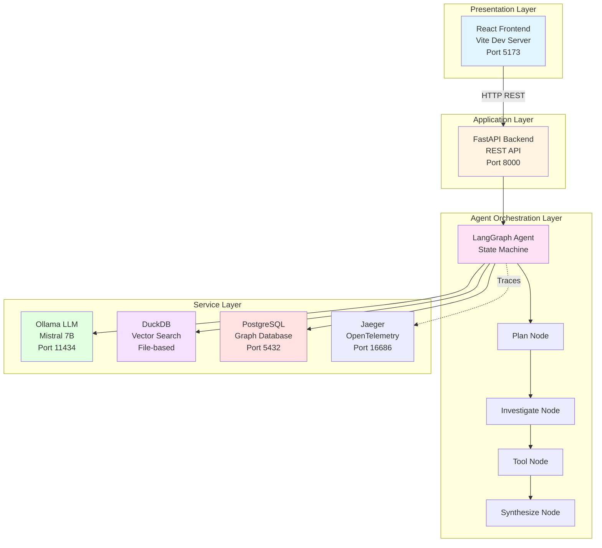
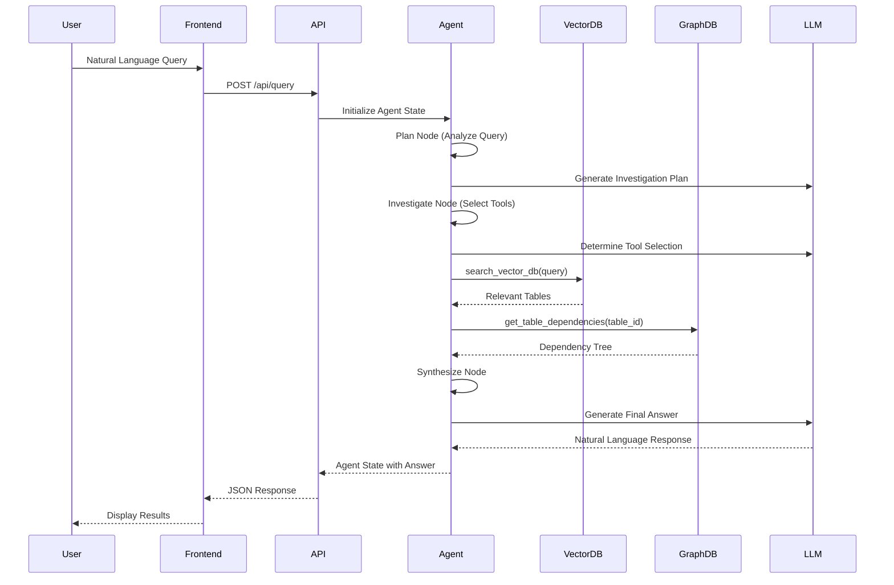
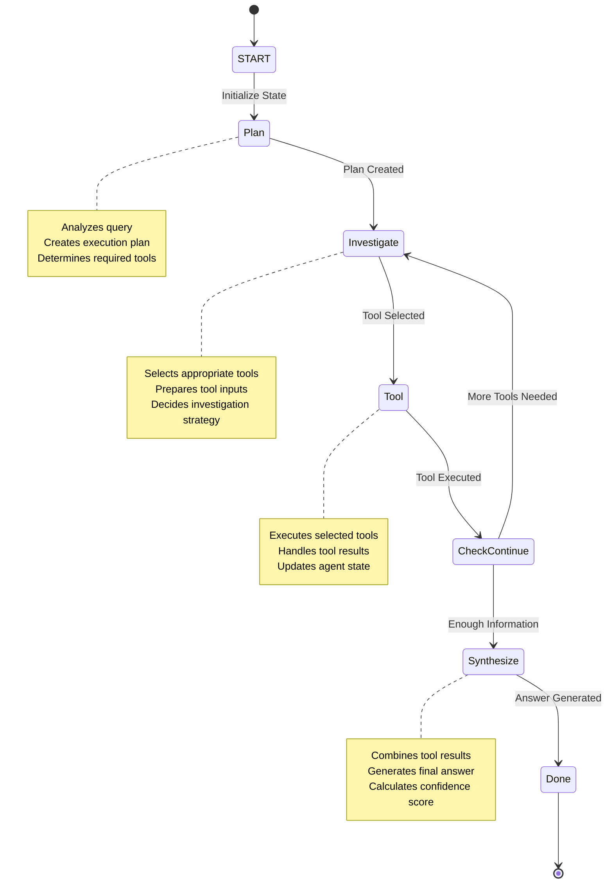
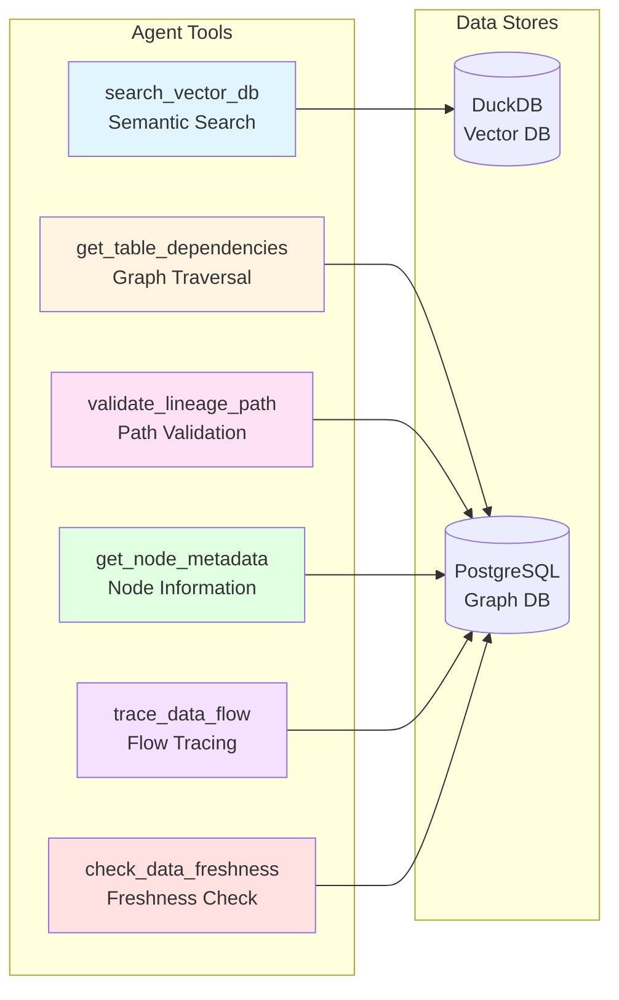
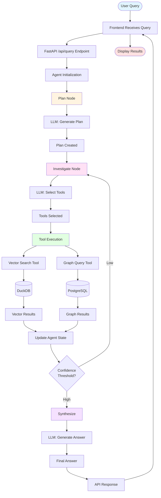
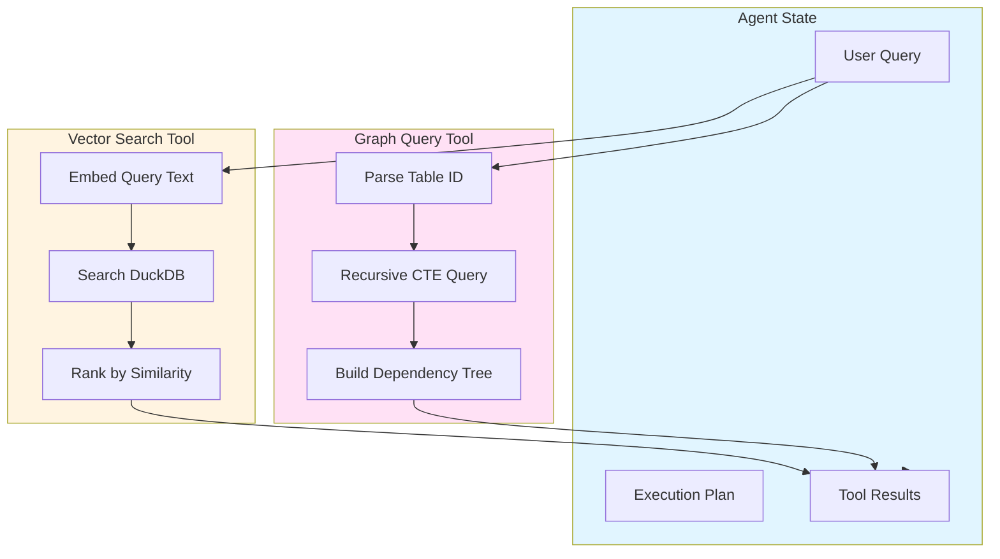
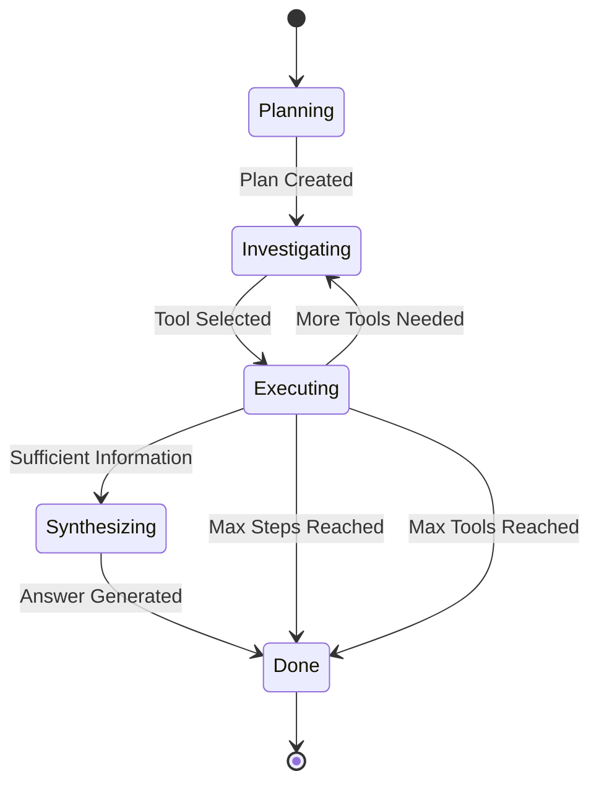
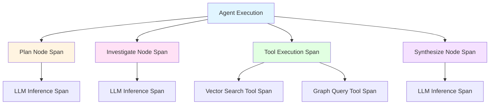

# LineageGraph Architecture Documentation

## Table of Contents

1. [System Overview](#system-overview)
2. [Architecture Layers](#architecture-layers)
3. [Component Details](#component-details)
4. [Data Flow](#data-flow)
5. [Agent System](#agent-system)
6. [Storage Layer](#storage-layer)
7. [API Design](#api-design)
8. [Performance Characteristics](#performance-characteristics)

## System Overview

LineageGraph is a semantic data lineage engine that enables natural language queries about data dependencies. The system is designed to run entirely locally with zero external API costs.

### Core Principles

- **Local-First**: All components run locally (LLM, databases, services)
- **Zero Cost**: No paid APIs or cloud services required
- **Modular**: Components can be swapped (e.g., Ollama → OpenAI, DuckDB → Pinecone)
- **Observable**: Built-in OpenTelemetry tracing for debugging

## Architecture Layers

### High-Level System Architecture



### Component Interaction Flow



## Component Details

### 1. Frontend Layer

**Technology**: React 18 + Vite 5

**Components**:
- `QueryInterface`: Natural language query input with validation
- `ResultsDisplay`: Formatted answer display with confidence scores
- `LineageVisualization`: Graph visualization (planned)

**Responsibilities**:
- User interface for querying
- Displaying results in readable format
- Visualizing lineage graphs
- Error handling and loading states

**Location**: `frontend/src/`

### 2. Backend API Layer

**Technology**: FastAPI 0.109.0 (Python)

**Endpoints**:
- `GET /health`: Health check endpoint
- `POST /api/query`: Main query endpoint with request validation

**Responsibilities**:
- HTTP request/response handling
- Input validation using Pydantic models
- Error handling and exception management
- CORS configuration for development

**Location**: `src/main.py`

### 3. Agent System

**Technology**: LangGraph 0.0.32

**Agent Graph Structure**:



**Nodes**:

1. **Plan Node** (`plan_node`)
   - Analyzes user query using LLM
   - Creates execution plan
   - Determines required tools and investigation strategy

2. **Investigate Node** (`investigate_node`)
   - Selects appropriate tools based on plan
   - Prepares tool inputs
   - Decides investigation strategy

3. **Tool Execution** (`tool_node`)
   - Executes selected tools
   - Handles tool results
   - Updates agent state with results

4. **Synthesize Node** (`synthesize_node`)
   - Combines tool results
   - Generates final answer using LLM
   - Calculates confidence score

**State Management**:
- `AgentState`: Typed state object with all agent information
- Fields: `user_query`, `current_step`, `plan`, `next_tool`, `tool_results`, `final_answer`, `confidence_score`, `step_count`, `tool_calls_made`

**Location**: `src/agents/`

### 4. Tools

The agent has access to six specialized tools:



**Tool Details**:

1. **search_vector_db**
   - Semantic search over table descriptions
   - Returns relevant tables with similarity scores
   - Uses DuckDB vector search with cosine similarity

2. **get_table_dependencies**
   - Recursive graph query for upstream dependencies
   - Returns dependency tree with depth information
   - Uses PostgreSQL recursive CTEs

3. **validate_lineage_path**
   - Validates if a path exists between two nodes
   - Returns boolean result with path length

4. **get_node_metadata**
   - Retrieves metadata for a specific node
   - Returns node information including type and description

5. **trace_data_flow**
   - Traces complete data flow path
   - Returns path with intermediate nodes

6. **check_data_freshness**
   - Checks data freshness score
   - Returns freshness metrics and last updated timestamp

**Location**: `src/agents/tools.py`

### 5. Vector Search Layer

**Technology**: DuckDB 1.4.3 + Sentence Transformers 5.2.0

**Components**:
- `VectorStore`: DuckDB-based vector database
- `LocalEmbedder`: Sentence-transformers embedder (all-MiniLM-L6-v2, 384 dimensions)

**Schema**:
```sql
CREATE TABLE embeddings (
    id VARCHAR PRIMARY KEY,
    text VARCHAR,
    table_name VARCHAR,
    column_names VARCHAR,
    source_type VARCHAR,
    created_at TIMESTAMP
);

CREATE TABLE vectors (
    id VARCHAR PRIMARY KEY,
    embedding DOUBLE[],
    FOREIGN KEY (id) REFERENCES embeddings(id)
);
```

**Operations**:
- `add_embedding()`: Store text and embedding
- `search()`: Cosine similarity search with configurable limit

**Location**: `src/vector/`

### 6. Graph Database Layer

**Technology**: PostgreSQL 15

**Schema**:
```sql
CREATE TABLE nodes (
    id VARCHAR PRIMARY KEY,
    node_type VARCHAR,  -- 'Table', 'Dashboard', 'Query'
    name VARCHAR,
    description TEXT,
    metadata JSONB,
    created_at TIMESTAMP
);

CREATE TABLE edges (
    id SERIAL PRIMARY KEY,
    source_id VARCHAR REFERENCES nodes(id),
    target_id VARCHAR REFERENCES nodes(id),
    edge_type VARCHAR,  -- 'FEEDS_INTO', 'DEPENDS_ON'
    strength FLOAT,
    created_at TIMESTAMP
);

-- Indexes for performance
CREATE INDEX idx_edges_source ON edges(source_id);
CREATE INDEX idx_edges_target ON edges(target_id);
```

**Operations**:
- `add_node()`: Add a node to the graph
- `add_edge()`: Add a relationship between nodes
- `get_dependencies()`: Recursive upstream query using WITH RECURSIVE

**Location**: `src/graph/`

### 7. LLM Service

**Technology**: Ollama

**Model**: Mistral 7B (default)

**API**: HTTP REST API at `http://localhost:11434/api/generate`

**Configuration**:
- Temperature: 0.3 (for factual answers)
- Model: mistral
- Timeout: 60 seconds
- Inference Speed: ~40 tokens/second on M2

**Location**: `src/main.py` (call_local_llm function)

## Data Flow

### Complete Query Processing Flow



### Tool Execution Details



## Agent System

### State Machine Details

The agent uses a state machine pattern with LangGraph:

**States**:
- `planning`: Creating execution plan
- `investigating`: Selecting and preparing tools
- `executing`: Running tools
- `synthesizing`: Generating final answer
- `done`: Query complete

**State Transitions**:



### Tool Selection Logic

The agent uses LLM-based tool selection:
1. Query analyzed in `investigate_node`
2. LLM determines which tools are needed based on query intent
3. Tools executed in sequence based on plan
4. Results accumulated in agent state
5. Confidence threshold determines if more investigation is needed

### Recursion Control

- Maximum recursion depth: 10 steps
- Maximum tool calls: 3 per query
- Prevents infinite loops
- Graceful degradation on recursion limit

## Storage Layer

### Vector Storage (DuckDB)

**File**: `semantic_lineage.duckdb`

**Characteristics**:
- File-based (no server needed)
- In-memory operations for fast queries
- Fast cosine similarity search
- Suitable for <10K vectors
- Zero network latency

**Backup**: File can be copied for backup

### Graph Storage (PostgreSQL)

**Database**: `semantic_lineage`

**Characteristics**:
- ACID compliance
- Recursive CTEs for graph traversal
- Indexes on source_id and target_id for performance
- JSONB for flexible metadata storage
- Supports complex graph queries

**Connection**: Configurable via `DATABASE_URL` environment variable

## API Design

### REST API

**Base URL**: `http://localhost:8000`

**Endpoints**:

1. **GET /health**
   - Purpose: Health check
   - Response: `{"status": "ok"}`

2. **POST /api/query**
   - Purpose: Execute lineage query
   - Request Body:
     ```json
     {
       "query": "What feeds into revenue dashboard?",
       "depth": 3
     }
     ```
   - Response:
     ```json
     {
       "query": "...",
       "answer": "...",
       "context_docs": [...],
       "lineage_path": {...},
       "confidence": 0.85
     }
     ```

### Agent API

**Direct Function Call**:
```python
from src.agents.graph import run_agent

result = run_agent("What feeds into revenue?", verbose=False)
```

**Response Structure**:
```python
{
    "user_query": "...",
    "current_step": "done",
    "final_answer": "...",
    "confidence_score": 0.85,
    "tool_calls_made": [...],
    "tool_results": {...}
}
```

## Performance Characteristics

### Latency Breakdown

| Component | Typical Latency | Notes |
|-----------|----------------|-------|
| Vector Search | <10ms | DuckDB in-memory |
| Graph Query | <50ms | PostgreSQL with indexes |
| LLM Inference | 2-5 seconds | Ollama on M2 (40 tokens/sec) |
| Total Query | 3-6 seconds | End-to-end |

### Performance Visualization

```mermaid
gantt
    title Query Processing Timeline
    dateFormat X
    axisFormat %Ls
    
    section Request
    HTTP Request           :0, 10
    API Validation         :10, 20
    
    section Agent
    Plan Node              :20, 500
    Investigate Node       :500, 1000
    Tool Execution         :1000, 1100
    Synthesize Node        :1100, 3500
    
    section Response
    Format Response        :3500, 3510
    HTTP Response          :3510, 3520
```



### Scalability

**Current Limits**:
- Vector DB: ~10K embeddings (DuckDB file-based)
- Graph DB: ~100K nodes/edges (PostgreSQL)
- Concurrent Queries: Limited by Ollama (single instance)

**Scaling Options**:
- Vector: Migrate to Pinecone or pgvector
- Graph: Add read replicas or use Neo4j
- LLM: Use OpenAI API or multiple Ollama instances

### Resource Usage

**Memory**:
- Ollama: ~4-8GB (Mistral 7B model)
- PostgreSQL: ~100MB (sample data)
- DuckDB: ~50MB (sample data)
- Python: ~200MB

**Disk**:
- Ollama model: ~4.4GB
- DuckDB file: ~10MB
- PostgreSQL data: ~50MB

## Observability

### OpenTelemetry Tracing

**Setup**:
```bash
export TRACING_ENABLED=true
docker run -p 16686:16686 jaegertracing/all-in-one:latest
```

**Trace Structure**:



**Traces**:
- Agent execution spans
- Tool call spans with inputs/outputs
- LLM inference spans with prompts/responses

**View**: http://localhost:16686

**Location**: `src/agents/tracing.py`

## Security Considerations

### Current Implementation

- CORS enabled for local development (`allow_origins=["*"]`)
- No authentication (local-only deployment)
- Database credentials in environment variables
- Input validation using Pydantic models

### Production Recommendations

- Implement authentication (JWT, OAuth)
- Restrict CORS origins to specific domains
- Use connection pooling for databases
- Add rate limiting to prevent abuse
- Encrypt sensitive data at rest
- Use HTTPS for all communications
- Implement API key authentication

## Future Enhancements

1. **Neo4j Integration**: Native graph database for complex queries
2. **Caching Layer**: Redis for query result caching
3. **Batch Processing**: Support for bulk queries
4. **Advanced Visualization**: Interactive lineage graphs with D3.js
5. **Multi-Model Support**: Support for multiple LLM providers
6. **Query History**: Store and replay previous queries
7. **User Authentication**: Multi-user support with role-based access
8. **Real-time Updates**: WebSocket support for live lineage updates

## References

- [LangGraph Documentation](https://github.com/langchain-ai/langgraph)
- [Ollama Documentation](https://ollama.ai/)
- [DuckDB Documentation](https://duckdb.org/)
- [PostgreSQL Documentation](https://www.postgresql.org/docs/)
- [FastAPI Documentation](https://fastapi.tiangolo.com/)
- [OpenTelemetry Documentation](https://opentelemetry.io/)
