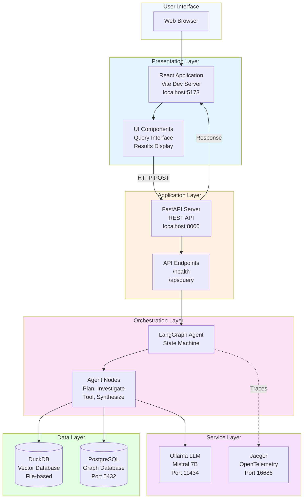
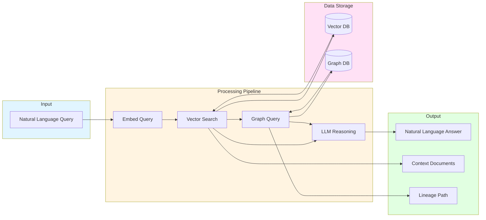
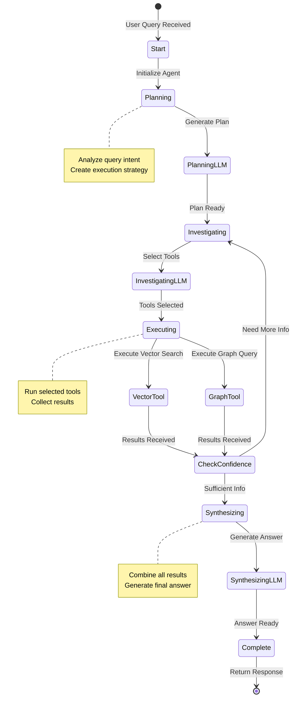
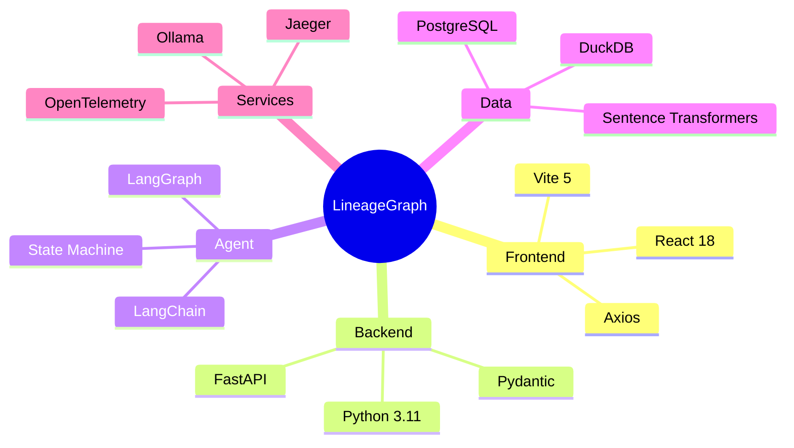
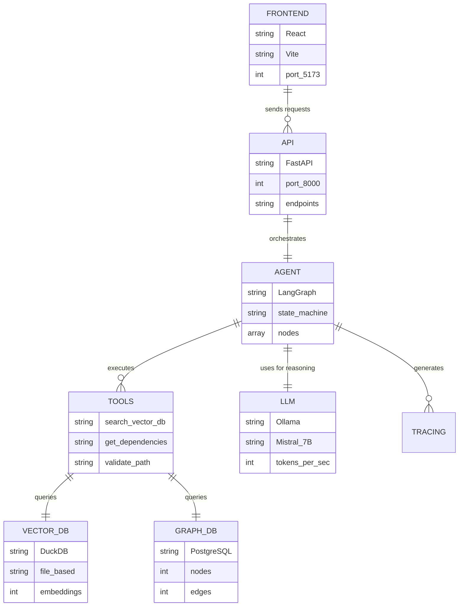
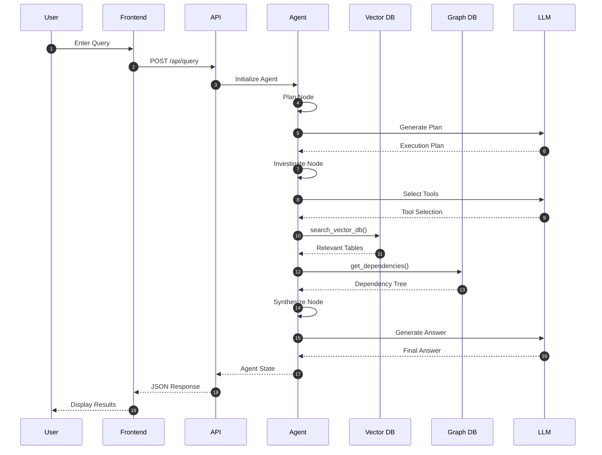
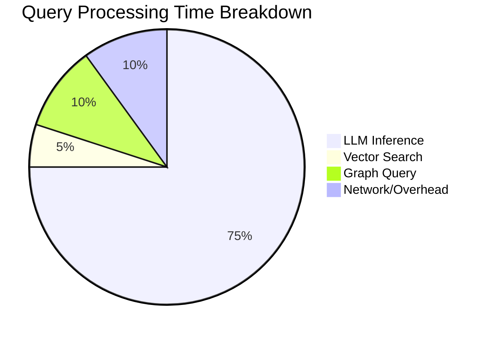
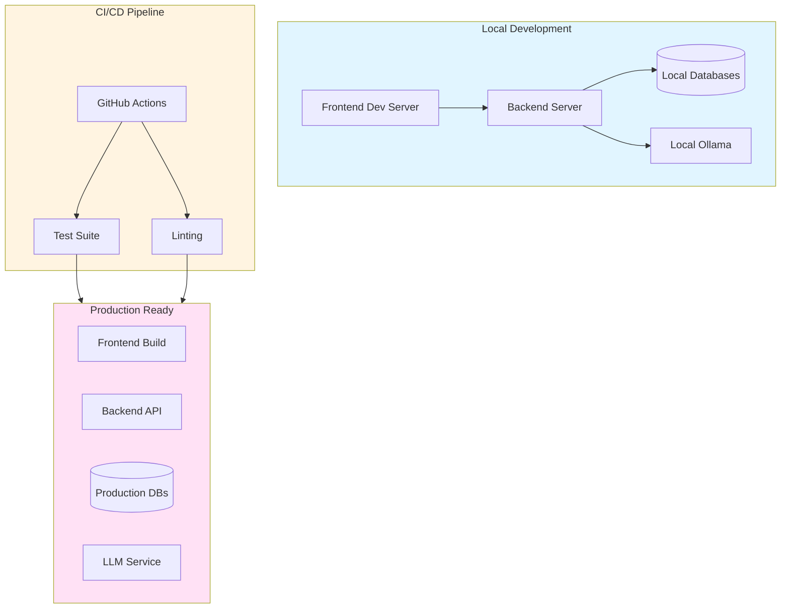

# System Overview

A comprehensive visual guide to the LineageGraph system architecture and data flow.

## System Architecture Diagram

## Data Flow Architecture

## Agent Workflow

## Technology Stack

## Component Relationships

## Request-Response Cycle

## Performance Metrics

## Deployment Architecture

